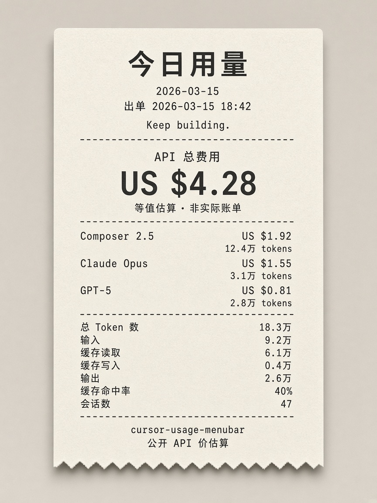
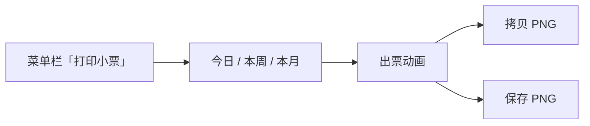

# cursor-usage-menubar

macOS 菜单栏小工具：在状态栏显示 Cursor 订阅用量（计划池百分比、On-demand、Codex 风格用量热力图），并按公开 API 价生成「AI 账单」热敏小票。



> 上图为**示意样例**（虚构模型用量与金额），不含任何真实账号或账单数据。

## 功能

- **菜单栏百分比**：与 Cursor 官网计划池一致（`Cursor` / `API` 两项可切换显示）
- **用量热力图**：绿阶贡献图（周横排、周日为首），对齐 Codex / CodexBar Token activity
- **打印小票**：今日 / 本周 / 本月；按模型合并估价，可拷贝到剪贴板或保存为 PNG
- **刷新策略**：1 分钟 / 5 分钟 / 手动；睡眠、锁屏时暂停
- **开机自启**：LaunchAgent；菜单「退出」后不再自动拉起

## 打印小票




- 出票中按 **Esc** 或点「跳过」直接出完；出完后再按 Esc 关闭
- **拷贝**：小票图片进剪贴板
- **保存**：导出为 PNG（默认桌面，会记住上次目录）
- 估价口径：公开 API 价；同一模型不同 effort 合并为一行；Auto / 未知模型按 Composer 2.5 估价
- **等值估算，不是实际账单**

示意样例见 [`docs/receipt-sample.png`](docs/receipt-sample.png)。

## 隐私

本工具在**本机**读取 Cursor IDE 登录态以拉取用量，**不会**把账号标识写进菜单文案或小票画面。

| 会用到（仅本机） | 不会出现在菜单 / 小票 / 导出图里 |
| --- | --- |
| Cursor 登录态（本地 `state.vscdb`） | 邮箱、显示名、用户 ID |
| 用量事件（模型、Token、时间戳） | Access Token / API Key |
| 事件缓存（用户目录下的 Caches） | 本机用户名、主机名、绝对路径 |

分享截图或导出小票前，仍建议确认画面里没有你自己贴上的敏感信息。仓库文档里的示意图一律使用虚构数据。

## 要求

- macOS
- 已登录的 [Cursor](https://cursor.com) IDE（本机）
- 命令行可执行 `swiftc`（Xcode Command Line Tools）

## 安装与使用

```bash
./build.sh
./cursor-usage-menubar          # 前台运行
./install-launchagent.sh        # 安装到 Application Support 并开机自启
./uninstall-launchagent.sh      # 取消自启、退出并删除安装副本
```

`install-launchagent.sh` 会把二进制和图标复制到 `~/Library/Application Support/cursor-usage-menubar/` 再运行，避免从可移动磁盘直接跑时反复弹出「访问可移动宗卷」。改完代码后重新执行一次安装脚本即可（源码比二进制新时会自动重编译）。

未登录或登录过期时，菜单栏显示 ⚠；点菜单里的账号行会打开 Cursor 并尝试触发登录。

### 用量热力图

- 点击标题折叠 / 展开
- 点击合计行切换 **本周**（周一起）/ **本月**
- 悬停格子显示日期与当日 Token 总量
- Token = 输入 + 输出 + 缓存读取 + 缓存写入（与小票一致）；满 1 万用「万」，满 1 亿用「亿」

### 刷新与缓存

| 选项 | 计划池 | 用量事件 |
| --- | --- | --- |
| 1 分钟（默认） | 每 1 分钟 | 每 5 分钟 |
| 5 分钟 | 每 5 分钟 | 每 15 分钟 |
| 手动 | 仅「立即刷新」 | 同左 |

- 打开菜单时，超过所选间隔会补刷（手动模式不补刷）
- 事件平时增量同步；约每 6 小时对账最近 35 天；首次或换账号拉满热力图窗口（26 周）
- 缓存路径：`~/Library/Caches/cursor-usage-menubar/events-v1.json`（删掉会触发一次全量拉取）

## 数据源

鉴权使用本机 Cursor IDE 的登录态；请求：

- `GetCurrentPeriodUsage` — 计费周期计划池
- `GetFilteredUsageEvents` — 用量事件（热力图、小票）
- `usage-summary` — On-demand 开关与额度

## 许可

按个人 / 学习用途自用即可。若再分发，请自行遵守 Cursor 服务条款与当地法律。
